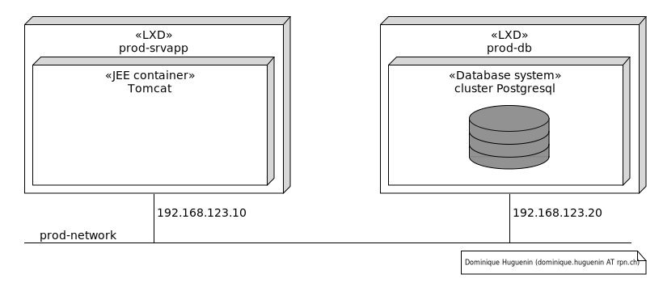

# personnes.infra - provisionnement et configuration de l'infrastructure
 
Ce projet met en place l'infrastructure permettant d'héberger une application web telle que **personnes.ui**. 

1. Créer un stockage dédié **prod-storage**
1. Créer un réseau dédié **prod-network**
1. Créer la machine virtuelle **prod-db**
1. Installer le cluster postgresql sur la machine **prod-db**
1. Créer la machine virtuelle **prod-srvapp**
1. Installer le serveur d'application tomcat sur la machine **prod-srvapp**

 *Illustration montrant l'infrastructure de production*

## Technologies utilisées

* [lxd](https://linuxcontainers.org/lxd/)
* [HashCorp Terraform](https://www.terraform.io/)
* [ansible](https://www.ansible.com/)

## Instructions

* initialisation de l'environnement de provisionnement

  ```bash
  $ cd .                        # se placer à la racine du projet
  $ direnv allow                # accepter la configuration de l'environnement direnv
  $ make                        # installer les dépendances
  $ terraform -chdir=tf init    # initialiser le state terraform
  ```

* provisionnement de l'infrastructure

  ```bash
  $ terraform -chdir=tf plan    # voir les changements qui seront effectué par terraform
  $ terraform -chdir=tf apply   # appliquer les changements
  ```

* vérification de l'infrastructure

  ```bash
  $ lxc list                    # afficher la liste des machines créées
  +----------------------+---------+-----------------------+------+-----------+-----------+
  |         NAME         |  STATE  |         IPV4          | IPV6 |   TYPE    | SNAPSHOTS |
  +----------------------+---------+-----------------------+------+-----------+-----------+
  | prod-db              | RUNNING | 192.168.123.20 (eth0) |      | CONTAINER | 0         |
  +----------------------+---------+-----------------------+------+-----------+-----------+
  | prod-srvapp          | RUNNING | 192.168.123.10 (eth0) |      | CONTAINER | 0         |
  +----------------------+---------+-----------------------+------+-----------+-----------+

  $ lxc profile list            # afficher la liste de profiles créés

  +-----------------+-------------------------------------------------------------------+---------+
  |      NAME       |                            DESCRIPTION                            | USED BY |
  +-----------------+-------------------------------------------------------------------+---------+
  | prod_network    |                                                                   | 2       |
  +-----------------+-------------------------------------------------------------------+---------+
  | prod_storage    | profile pour l'utilisation de stockage default pour la production | 2       |
  +-----------------+-------------------------------------------------------------------+---------+

  $ lxc network list            # afficher la liste de réseau créés

  +--------------+----------+---------+------------------+------+-------------+---------+---------+
  |     NAME     |   TYPE   | MANAGED |       IPV4       | IPV6 | DESCRIPTION | USED BY |  STATE  |
  +--------------+----------+---------+------------------+------+-------------+---------+---------+
  | prod_network | bridge   | YES     | 192.168.123.1/24 | none |             | 3       | CREATED |
  +--------------+----------+---------+------------------+------+-------------+---------+---------+

  ```

* destruction de l'infrastructure

  ```bash
  $ terraform -chdir=tf destroy # détruire toutes les ressources créées par terraform
  ```

* vérification de la présence des machines

  ```bash
  ubuntu@b316-hd-s-557:~$ lxc list
  +-------------+---------+-----------------------+------+-----------+-----------+
  |    NAME     |  STATE  |         IPV4          | IPV6 |   TYPE    | SNAPSHOTS |
  +-------------+---------+-----------------------+------+-----------+-----------+
  | prod-db     | RUNNING | 192.168.123.20 (eth0) |      | CONTAINER | 0         |
  +-------------+---------+-----------------------+------+-----------+-----------+
  | prod-srvapp | RUNNING | 192.168.123.10 (eth0) |      | CONTAINER | 0         |
  +-------------+---------+-----------------------+------+-----------+-----------+

  ```

* vérification de l'accessibilité du cluster de base de données

  ```bash
  ubuntu@b316-hd-s-557:~$ psql -h 192.168.123.20 -p 5432 -U postgres -W postgres
  Password: 
  psql (12.12 (Ubuntu 12.12-0ubuntu0.20.04.1))
  SSL connection (protocol: TLSv1.3, cipher: TLS_AES_256_GCM_SHA384, bits: 256, compression: off)
  Type "help" for help.

  postgres=# \l
                                    List of databases
    Name    |  Owner   | Encoding |   Collate   |    Ctype    |   Access privileges   
  -----------+----------+----------+-------------+-------------+-----------------------
  postgres  | postgres | UTF8     | en_US.UTF-8 | en_US.UTF-8 | 
  template0 | postgres | UTF8     | en_US.UTF-8 | en_US.UTF-8 | =c/postgres          +
            |          |          |             |             | postgres=CTc/postgres
  template1 | postgres | UTF8     | en_US.UTF-8 | en_US.UTF-8 | =c/postgres          +
            |          |          |             |             | postgres=CTc/postgres
  (3 rows)

  postgres=# 
  ```

* vérification de l'accès au serveur d'application JEE tomcat  http://192.168.123.10/manager/html


