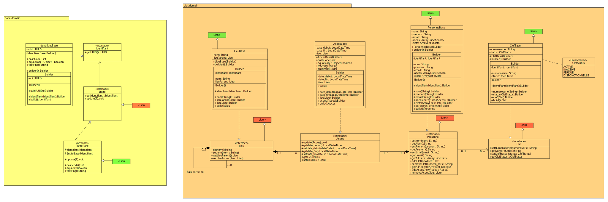

# 1. Projet ─ Gestion des clefs d'une institution et historique des accès 

- [1. Projet ─ Gestion des clefs d'une institution et historique des accès](#1-projet--gestion-des-clefs-dune-institution-et-historique-des-accès)
- [2. Besoin](#2-besoin)
- [3. Livrables attendus](#3-livrables-attendus)
  - [3.1. Document d'analyse](#31-document-danalyse)
  - [3.2. Script de création de la base de données](#32-script-de-création-de-la-base-de-données)
  - [3.3. Implémentation](#33-implémentation)
  - [3.4. DoD (Definition of Done)](#34-dod-definition-of-done)
  - [3.5. Personnas](#35-personnas)
  - [3.6. Maquettes](#36-maquettes)
    - [3.6.1. Liste des personnes (Liste)](#361-liste-des-personnes-liste)
    - [3.6.2. Détail d'une personne (Détail \<\<création\>\>)](#362-détail-dune-personne-détail-création)
    - [3.6.3. Détail d'une personne (Détail \<\<visualisation\>\>)](#363-détail-dune-personne-détail-visualisation)
    - [3.6.4. Détail d'une personne (Détail \<\<modification\>\>)](#364-détail-dune-personne-détail-modification)
    - [3.6.5. Détail d'une personne (Détail \<\<suppression\>\>)](#365-détail-dune-personne-détail-suppression)
    - [3.6.6. Liste des clefs (Liste)](#366-liste-des-clefs-liste)
    - [3.6.7. Action d'une clef (Détail \<\<création\>\>)](#367-action-dune-clef-détail-création)
    - [3.6.8. Détail d'une clef (Détail \<\<visualisation\>\>)](#368-détail-dune-clef-détail-visualisation)
    - [3.6.9. Détail d'une clef (Détail \<\<modification\>\>)](#369-détail-dune-clef-détail-modification)
    - [3.6.10. Détail d'une clef (Détail \<\<suppression\>\>)](#3610-détail-dune-clef-détail-suppression)
    - [3.6.11. Liste des lieux (Liste)](#3611-liste-des-lieux-liste)
    - [3.6.12. Détail d'un lieu (Détail \<\<création\>\>)](#3612-détail-dun-lieu-détail-création)
    - [3.6.13. Détail d'un lieu (Détail \<\<visualisation\>\>)](#3613-détail-dun-lieu-détail-visualisation)
    - [3.6.14. Détail d'un lieu (Détail \<\<modification\>\>)](#3614-détail-dun-lieu-détail-modification)
    - [3.6.15. Détail d'un lieu (Détail \<\<suppression\>\>)](#3615-détail-dun-lieu-détail-suppression)
- [4. Base de donnée PSQL](#4-base-de-donnée-psql)
  - [4.1. MCD](#41-mcd)
  - [4.2. MLD](#42-mld)
  - [4.3. Diagramme de navigation](#43-diagramme-de-navigation)
  - [4.4. Scripts](#44-scripts)
    - [4.4.1. Tutoriel de création de la base de données](#441-tutoriel-de-création-de-la-base-de-données)
      - [4.4.1.1. Tutoriel de création de la base de données de test](#4411-tutoriel-de-création-de-la-base-de-données-de-test)
- [5. Programme JAVA](#5-programme-java)
  - [5.1. Modèle de classe](#51-modèle-de-classe)
    - [5.1.1. Diagramme de classe](#511-diagramme-de-classe)
    - [5.1.2. Diagramme d'interface](#512-diagramme-dinterface)
    - [5.1.3. Généralisation](#513-généralisation)
    - [5.1.4. Builders](#514-builders)
    - [5.1.5. Diagramme d'objet](#515-diagramme-dobjet)
    - [5.1.6. Diagramme d'objet cloné](#516-diagramme-dobjet-cloné)
- [6. Utilisation du projet](#6-utilisation-du-projet)
  - [6.1. Java](#61-java)
  - [6.2. Postgres](#62-postgres)
- [7. Liens](#7-liens)


# 2. Besoin

* un lieu peut être verrouillé par plusieurs serrures.
* une clef peut déverrouiller les serrures de plusieurs lieux.
* une personne est propriétaire d'une seul clef.
* une personne peut accéder à plusieurs lieux
* un lieu est composé de lieu.
* un historique des accès permet de connaître qui a accédé où et quand.
* un historique des modifications permet de connaître qui reçoit l'accès où et quand.

# 3. Livrables attendus 

## 3.1. Document d'analyse

Le document d'analyse doit contenir:
─ [x] des maquettes d'interfaces (écran ou api) avec des données pertinentes et en nombre suffisant
─ [x] un modèle conceptuel de données
─ [x] un modèle logique de données
─ [x] un modèle de classes
─ [x] Le modèle logique de données doit être enrichi avec les champs d'audits. (voir SUNIER, 2016, *Modèle logique de données relationnel*, 14.2 Audit)

## 3.2. Script de création de la base de données

Le script de création doit:
─ [x] Supprimer les tables du domaine
─ [x] Créer les tables du domaine avec les contraintes
─ [x] Ajouter dans les tables un jeu de données de test
─ [x] Les champs d'audit sont mis à jour par l'intermédiaire de triggers et procédures stockées. Les commandes INSERT ou UPDATE ne peuvent pas directement modifier ces colonnes. 

## 3.3. Implémentation

Écrire:
─ [x] Les classes du domaine et leurs classes de test
─ [x] Une classe `DemoData` retournant un `Map<UUID,Entite>` pour chaque entité indépendante du domaine. Ces différents Map doivent contenir les données de test.
─ [x] Des tests unitaires interrogeant la base de données à l'aide de la libraire JDBC et instanciant les classes du domaines. (éléments théorique voir [APS ─ Rappel Java, JDBC](https://mylos.cifom.ch/gitlab/dhu.cours/tutojava/070─tutojdbc/blob/master/JavaJDBC.md))

## 3.4. DoD (Definition of Done)

Le DoD précise la rigueur souhaitée avant de passer une tâche en terminer.

Documentation:
* Les documents doivent être validés par tous les membres du Groupe

SQL:
* Le MLD doit respecter les formes normales de 1 à 5
* Les scripts s'executent avec 0 erreur

Java:
* La classe doit pouvoir build et compile sans erreur
* Les tests doivent couvrir au moins 95% du code
* Les tests doivent être 100% validés

## 3.5. Personnas

* Le responsable des autorisations : Cette persona serait responsable de la création et de la gestion des droits d'accès attribués aux différentes personnes dans le système. Il ou elle pourrait utiliser le logiciel de gestion de clés pour attribuer des droits d'accès à des emplacements spécifiques pour chaque utilisateur, ainsi que pour surveiller l'utilisation de ces droits d'accès.

* L'utilisateur du système : Cette persona serait celle qui a besoin d'accéder à des emplacements sécurisés pour accomplir des tâches spécifiques dans le système. Il ou elle pourrait utiliser le logiciel de gestion de clés pour demander des clés pour récuperer des droits d'accès nécessaires à l'exécution de sa tâche.

* L'administrateur de système : Cette persona serait responsable de la configuration et de la maintenance du système de gestion de clés. Il ou elle pourrait utiliser le logiciel de gestion de clés pour configurer les paramètres de sécurité, surveiller l'utilisation du système et gérer les clés et les certificats dans le système.

## 3.6. Maquettes

### 3.6.1. Liste des personnes (Liste)

```
Liste des personnes
===================

[rechercher] : ________________________

[ajouter une personne]


│ action │     nom     │  prenom   │          e-mail             │
├────────┼─────────────┼───────────┼─────────────────────────────┤
│ [voir] │ Ameli       │ Darwin    │ darwin.ameli@rpn.ch         │
│ [voir] │ Paiva Costa │ Diogo     │ diogo.paivacosta@rpn.ch     │
│ [voir] │ Tobler      │ Cyril     │ cyril.tobler@rpn.ch         │
│ [voir] │ Caillet     │ Cedric    │ cedric.caillet@rpn.ch       │
│ [voir] │ Huguenin    │ Dominique │ dominique.huguenin@rpn.ch   │

```

### 3.6.2. Détail d'une personne (Détail \<\<création>>)

```
Détail d'une personne
===================

[annuler] [valider création]

id: ;  version: ;  Création: ,  ;

nom: ___________________________
prenom: ________________________
e─mail: ________________________

Clefs appartenant à Darwin Ameli
│      action       │    clefs actives    │
├───────────────────┼─────────────────────┤
│  [ajouter clef]   │ __________________V │


Droit d'accès de Darwin Ameli
│      action       │     droit d'accès     │
├───────────────────┼───────────────────────┤
│  [ajouter lieu]   │ ____________________V │

```

### 3.6.3. Détail d'une personne (Détail \<\<visualisation>>)

```
Détail d'une personne
===================

[annuler][modifier][supprimer]

id: DEMO0000-0000-0000-0003-000000000001;  version: 0;  Création: testUser,  2022-12-01 14:50;

nom: Ameli
prenom: Darwin
e─mail: darwin.ameli@rpn.ch

Clefs appartenant à Darwin Ameli
│ action │    clefs actives    │
├────────┼─────────────────────┤
│ [voir] │ 0000─0000─0000─0002 │
│ [voir] │ 0000─0000─0000─0012 │
│ [voir] │ 0000─0000─0000─0034 │

Droit d'accès de Darwin Ameli
│ action │     droit d'accès     │
├────────┼───────────────────────┤
│ [voir] │ CIFOM ─ Etage 3 ─ 315 │
│ [voir] │ CPLN ─ Etage 1 ─ B102 │
│ [voir] │ CPLN ─ Etage 2        │

```

### 3.6.4. Détail d'une personne (Détail \<\<modification>>)

```
Détail d'une personne
=====================

[annuler] [valider modification]

id: DEMO0000-0000-0000-0003-000000000001;  version: 0;  Création: testUser,  2022-12-01 14:50;

nom: Ameli_____________________
prenom: Darwin_________________
e─mail: darwin.ameli@rpn.ch____

Clefs appartenant à Darwin Ameli
│      action       │    clefs actives    │
├───────────────────┼─────────────────────┤
│ [voir][supprimer] │ 0000─0000─0000─0002 │
│ [voir][supprimer] │ 0000─0000─0000─0012 │
│ [voir][supprimer] │ 0000─0000─0000─0034 │
│  [ajouter clef]   │ __________________V │


Droit d'accès de Darwin Ameli
│      action       │     droit d'accès     │
├───────────────────┼───────────────────────┤
│ [voir][supprimer] │ CIFOM ─ Etage 3 ─ 315 │
│ [voir][supprimer] │ CPLN ─ Etage 1 ─ B102 │
│ [voir][supprimer] │ CPLN ─ Etage 2        │
│  [ajouter lieu]   │ ____________________V │

```

### 3.6.5. Détail d'une personne (Détail \<\<suppression>>)

```
Détail d'une personne
=====================

[annuler] [valider suppression]

id: DEMO0000-0000-0000-0003-000000000001;  version: 0;  Création: testUser,  2022-12-01 14:50;

nom: Ameli
prenom: Darwin
e─mail: darwin.ameli@rpn.ch

Clefs appartenant à Darwin Ameli
│ action │    clefs actives    │
├────────┼─────────────────────┤
│ [voir] │ 0000─0000─0000─0002 │
│ [voir] │ 0000─0000─0000─0012 │
│ [voir] │ 0000─0000─0000─0034 │

Droit d'accès de Darwin Ameli
│ action │     droit d'accès     │
├────────┼───────────────────────┤
│ [voir] │ CIFOM ─ Etage 3 ─ 315 │
│ [voir] │ CPLN ─ Etage 1 ─ B102 │
│ [voir] │ CPLN ─ Etage 2        │
```

### 3.6.6. Liste des clefs (Liste)

```
Liste des clefs
===================

[rechercher] : ________________________

[ajouter une nouvelle clef...]


│ action │   numero de serie   │      status      │       personne            │
├────────┼─────────────────────┼──────────────────┼───────────────────────────┤
│ [voir] │ 0000─0000─0000─0001 │ ACTIVE           │ caillet.cedric@rpn.ch     │
│ [voir] │ 0000─0000─0000─0002 │ ACTIVE           │ cyril.tobler@rpn.ch       │
│ [voir] │ 0000─0000─0000─0003 │ ACTIVE           │ diogo.paivacosta@rpn.ch   │
│ [voir] │ 0000─0000─0000─0004 │ ACTIVE           │ dominique.huguenin@rpn.ch │
│ [voir] │ 0000─0000─0000─0005 │ ACTIVE           │ darwin.ameli@rpn.ch       │
│ [voir] │ 0000─0000─0000─0006 │ DISFONCTIONNELLE │                           │
│ [voir] │ 0000─0000─0000─0007 │ PERDUE           │                           │
│ [voir] │ 0000─0000─0000─0008 │ INACTIVE         │                           │
```

### 3.6.7. Action d'une clef (Détail \<\<création>>)

```
Détail d'une clef
===================

[annuler] [valider création]

id: ;  version: ;  Création: ,  ;

numéro de série: 0000─0000─0000─0005
status: INACTIVE___________________V
personne: 

```

### 3.6.8. Détail d'une clef (Détail \<\<visualisation>>)

```
Détail d'une clef
===================

[annuler][modifier][supprimer]

id: 0000─0000─0000─0001;  version: 0;  Création: testUser,  2022-12-01 14:50;

numéro de série: 0000─0000─0000─0001
status: ACTIVE
personne: cedric.caillet@rpn.ch
```

### 3.6.9. Détail d'une clef (Détail \<\<modification>>)

```
Détail d'une clef
=====================

[annuler] [valider modification]

id: 0000─0000─0000─0002;  version: 0;  Création: testUser,  2022-12-01 14:50;

numéro de série: 0000─0000─0000─0002
status: Active______________________V  
personne: ToblerC
```

### 3.6.10. Détail d'une clef (Détail \<\<suppression>>)

```
Détail d'une clef
=====================

[annuler] [valider suppression]

id: 0000─0000─0000─0001;  version: 0;  Création: testUser,  2022-12-01 14:50;

numéro de série: 0000─0000─0000─0001
status: ACTIVE
personne: cedric.caillet@rpn.ch
```

### 3.6.11. Liste des lieux (Liste)

```
Liste des lieux
===================

[rechercher] : ________________________

[ajouter un lieu]


│ action │           nom           │
├────────┼─────────────────────────┤
│ [voir] │ CIFOM                   │
│ [voir] │ CIFOM ─ Etage 3         │
│ [voir] │ CIFOM ─ Etage 3 ─ 315   │
│ [voir] │ CPLN                    │
│ [voir] │ CPLN ─ Etage 1          │
│ [voir] │ CPLN ─ Etage 1 ─ B101   │
│ [voir] │ CPLN ─ Etage 1 ─ B102   │
│ [voir] │ CPLN ─ Etage 2          │
│ [voir] │ CPLN ─ Etage 2 ─ B205   │
│ [voir] │ CPLN ─ Etage 2 ─ B206   │
│ [voir] │ CPLN ─ Etage 3          │
│ [voir] │ CPLN ─ Etage 3 ─ B302   │
│ [voir] │ CPLN ─ Etage 3 ─ B303   │
│ [voir] │ CPLN ─ Etage 4          │
│ [voir] │ CPLN ─ Etage 4 ─ B401   │

```

### 3.6.12. Détail d'un lieu (Détail \<\<création>>)

```
Détail d'un lieu
===================

[annuler] [valider création]

id: ;  version: ;  Création: ,  ;

nom: ________________________
lieu parent: _______________V

```

### 3.6.13. Détail d'un lieu (Détail \<\<visualisation>>)

```
Détail d'un lieu
===================

[annuler][modifier][supprimer]

id: DEMO0000-0000-0000-0003-000000000001;  version: 0;  Création: testUser,  2022-12-01 14:50;

nom: CPLN
lieu parent:

```

### 3.6.14. Détail d'un lieu (Détail \<\<modification>>)

```
Détail d'un lieu
=====================

[annuler] [valider modification]

id: DEMO0000-0000-0000-0003-000000000002;  version: 0;  Création: testUser,  2022-12-01 14:50;

nom: B101____________________
lieu parent: CPLN ─ Etage 1__V

```

### 3.6.15. Détail d'un lieu (Détail \<\<suppression>>)

```
Détail d'un lieu
=====================

[annuler] [valider suppression]

id: DEMO0000-0000-0000-0003-000000000002;  version: 0;  Création: testUser,  2022-12-01 14:50;

nom: Etage 1
lieu parent: CPLN

```


# 4. Base de donnée PSQL

## 4.1. MCD

## 4.2. MLD

## 4.3. Diagramme de navigation


## 4.4. Scripts
### 4.4.1. Tutoriel de création de la base de données
* Créer une base de donnée local "clefDB"
* Créer un utilisateur "clef" avec le MDP "clefPASS"
* Ajouter l'utilisateur clef à la base de donnée clefDB
* Executer le script "script.sh"
```
./script.sh > requete.log
```
#### 4.4.1.1. Tutoriel de création de la base de données de test
* Créer une base de donnée local "clefDB_Dev"
* Utiliser l'utilisateur "clef" avec le MDP "clefPASS"
* Utiliser l'utilisateur clef à la base de donnée clefDB
* Executer le script "scriptDev.sh"
```
./scriptDev.sh > requeteDev.log
```


# 5. Programme JAVA
## 5.1. Modèle de classe
### 5.1.1. Diagramme de classe


### 5.1.2. Diagramme d'interface



### 5.1.3. Généralisation 

Le modèle de classe comprend des notions de généralisation ; Les interfaces héritent d'`Entite` qui est une interface générale.

Le but est de généraliser des méthodes qui sont communes à toutes les interfaces, par exemple `toString():String` qui est utilisable par toutes les classes.

On va donc imager l'interface d'une classe qui va contenir ses méthodes, ainsi que les méthodes qu'elle va hériter de l'interface `Entite`. 

### 5.1.4. Builders

Les builders sont une bonne pratique consistant à empecher le developpeur d'instancier un objet avec `new` .

Le but est d'obliger le developpeur a crée son objet à l'aide d'un builder : 

```
private Identifiant identifiantRef;
identifiantRef = IdentifiantBase.builder().build();
```

Noté que l'attribut `─IdentifiantBase(UUID)` de l'entité `IdentifiantBase` est privé, il n'est donc pas instanciable. Le developpeur est donc forcé d'utiliser le builder.

Exemple d'instanciation avant après

```
Recette entiteRef = new RecetteBase();
entiteRef.setIdentifiant();
entiteRef.setNom("Aubergines au four");
...
```
```
entiteRef = RecetteBase.builder()
                .identifiant(identifiantRef)
                .audit(auditRef)
                .nom(nomRef)
                .detail(detailRef)
                .preparation(preparationRef)
                .nombrePersonnes(nombrePersonneRef)
                .composant(composantRef1)
                .composant(composantRef2)
                .composant(composantRef3)
                .build();
```

### 5.1.5. Diagramme d'objet


### 5.1.6. Diagramme d'objet cloné


# 6. Utilisation du projet

## 6.1. Java
─ Pour utiliser le projet sur un serveur différent modifier [Le fichier de propriété](java/clef/DB.properties)
```properties
#Données de connexion à la BD
#Nom ou adresse du serveur postgre
serverName = 127.0.0.1
#port d'accès du serveur de postgre
portNumber = 5432
#Nom de la base de donnée
dataBaseName = clefDB
#utilisateur ayant accès à la BD
user = clef
#Mot de passe de l'utilisateur
password = clefPASS
```
Idem pour la BD de [dev](java/clef/DBDev.properties)
## 6.2. Postgres
─ Pour utiliser les scripts il faut modifier le script de [connexion](./psql/script.sh)
```sh
#!/bin/bash
#Nom ou adresse du serveur postgres
HOST=127.0.0.1
#port d'accès du serveur de postgres
PORT=5432
#utilisateur ayant accès à la BD
USER=clef
#Mot de passe de l'utilisateur
PASSWORD=clefPASS
#Nom de la base de donnée
DATABASE=clefDB
PSQL_SCRIPT=script.psql

PGPASSWORD=$PASSWORD psql ─h $HOST ─p $PORT ─U $USER $DATABASE ─f $PSQL_SCRIPT
```
Idem pour la BD de [test](psql/scriptDev.sh)
# 7. Liens
[SCRUM POKER](https://www.scrumpoker─online.org/fr/)

[UML](https://laurent─audibert.developpez.com/Cours─UML/?page=mise─en─oeuvre─uml#L9─3─2)

[JDBC](https://mylos.cifom.ch/gitlab/dhu.cours/tutojava/070─tutojdbc/blob/master/JavaJDBC.md)

[MERMAID markdown Diagramme de classe](https://mermaid─js.github.io/mermaid/#/./classDiagram)

[DemoData ─ Fichier de démo](https://mylos.cifom.ch/gitlab/dhu.projets/campanule/campanule.lib/─/blob/master/src/main/java/campanule/domain/DemoData.java)

[Cours intprog2aps](https://mylos.cifom.ch/gitlab/dhu.cours/intprog2aps/intprog2aps.suivi2022─2int─s─pma/─/wikis/home)