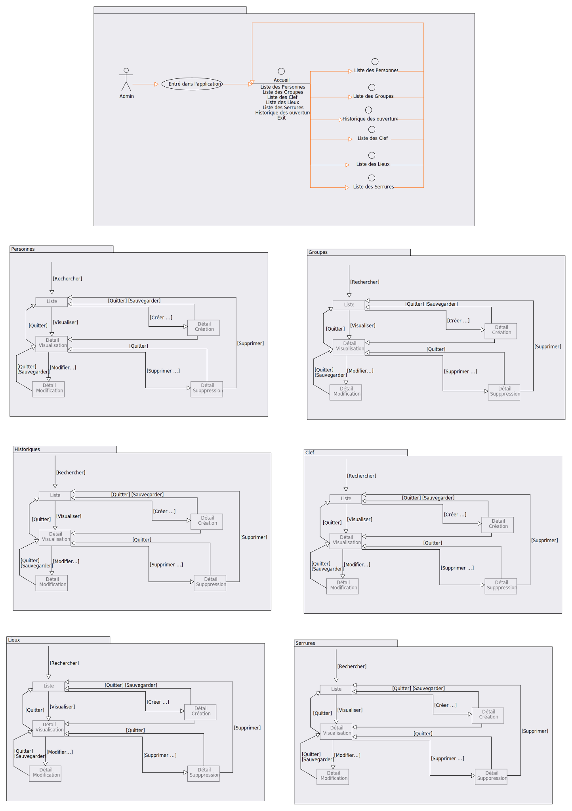

# 1. projet - Gestion des clés d'une institution et historique des accès
- [1. projet - Gestion des clés d'une institution et historique des accès](#1-projet---gestion-des-clés-dune-institution-et-historique-des-accès)
- [2. Besoin](#2-besoin)
- [3. Livrables attendus](#3-livrables-attendus)
  - [3.1. Document d'analyse](#31-document-danalyse)
  - [3.2. Script de création de la base de données](#32-script-de-création-de-la-base-de-données)
  - [3.3. Implémentation](#33-implémentation)
  - [3.4. DoD (Definition of Done)](#34-dod-definition-of-done)
- [4. Base de donnée PSQL](#4-base-de-donnée-psql)
  - [4.1. MCD](#41-mcd)
  - [4.2. MLD](#42-mld)
  - [4.3. Prototypes](#43-prototypes)
    - [4.3.1. Liste des clefs (Liste)](#431-liste-des-clefs-liste)
    - [4.3.2. Détail d'une clef (Détail \<\<création>>)](#432-détail-dune-clef-détail-création)
    - [4.3.3. Détail d'une clef (Détail \<\<visualisation>>)](#433-détail-dune-clef-détail-visualisation)
    - [4.3.4. Détail d'une clef (Détail \<\<modification>>)](#434-détail-dune-clef-détail-modification)
    - [4.3.5. Détail d'une clef (Détail \<\<suppression>>)](#435-détail-dune-clef-détail-suppression)
    - [4.3.6. Liste des serrures (Liste)](#436-liste-des-serrures-liste)
    - [4.3.7. Détail d'une serrure (Détail \<\<création>>)](#437-détail-dune-serrure-détail-création)
    - [4.3.8. Détail d'une serrure (Détail \<\<visualisation>>)](#438-détail-dune-serrure-détail-visualisation)
    - [4.3.9. Détail d'une serrure (Détail \<\<modification>>)](#439-détail-dune-serrure-détail-modification)
    - [4.3.10. Détail d'une serrure (Détail \<\<suppression>>)](#4310-détail-dune-serrure-détail-suppression)
    - [4.3.11. Liste des utilisateurs (Liste)](#4311-liste-des-utilisateurs-liste)
    - [4.3.12. Détail d'un utilisateur (Détail \<\<création>>)](#4312-détail-dun-utilisateur-détail-création)
    - [4.3.13. Détail d'un utilisateur (Détail \<\<visualisation>>)](#4313-détail-dun-utilisateur-détail-visualisation)
    - [4.3.14. Détail d'un utilisateur (Détail \<\<modification>>)](#4314-détail-dun-utilisateur-détail-modification)
    - [4.3.15. Détail d'un utilisateur (Détail \<\<suppression>>)](#4315-détail-dun-utilisateur-détail-suppression)
    - [4.3.16. Liste des groupes (Liste)](#4316-liste-des-groupes-liste)
    - [4.3.17. Détail d'un groupe (Détail \<\<création>>)](#4317-détail-dun-groupe-détail-création)
    - [4.3.18. Détail d'un groupe (Détail \<\<visualisation>>)](#4318-détail-dun-groupe-détail-visualisation)
    - [4.3.19. Détail d'un groupe (Détail \<\<modification>>)](#4319-détail-dun-groupe-détail-modification)
    - [4.3.20. Détail d'un groupe (Détail \<\<suppression>>)](#4320-détail-dun-groupe-détail-suppression)
    - [4.3.21. Liste des lieux (Liste)](#4321-liste-des-lieux-liste)
    - [4.3.22. Détail d'un lieu (Détail \<\<création>>)](#4322-détail-dun-lieu-détail-création)
    - [4.3.23. Détail d'un lieu (Détail \<\<visualisation>>)](#4323-détail-dun-lieu-détail-visualisation)
    - [4.3.24. Détail d'un lieu (Détail \<\<modification>>)](#4324-détail-dun-lieu-détail-modification)
    - [4.3.25. Détail d'un lieu (Détail \<\<suppression>>)](#4325-détail-dun-lieu-détail-suppression)
  - [4.4. Diagramme de navigation](#44-diagramme-de-navigation)
  - [4.5. Scripts](#45-scripts)
- [5. Programme JAVA](#5-programme-java)
  - [5.1. Modèle de classe](#51-modèle-de-classe)
    - [5.1.1. SVG](#511-svg)
    - [5.1.2. Mermaid](#512-mermaid)
- [6. Utilisation du projet](#6-utilisation-du-projet)
  - [6.1. Java](#61-java)
  - [6.2. Postgres](#62-postgres)
- [7. Liens](#7-liens)


# 2. Besoin

* un lieu peut être verrouillé par plusieurs serrures.
* une clé peut déverrouiller les serrures de plusieurs lieux.
* une personne est propriétaire d'une seul clé.
* une personne peut accéder à plusieurs lieux
* un lieu est composé de lieu.
* un historique des accès permet de connaître qui a accédé où et quand.
* un historique des modifications permet de connaître qui reçoit l'accès où et quand.

# 3. Livrables attendus 

## 3.1. Document d'analyse

Le document d'analyse doit contenir:
* des maquettes d'interfaces (écran ou api) avec des données pertinentes et en nombre suffisant
* un modèle conceptuel de données
* un modèle logique de données
* un modèle de classes

Le modèle logique de données doit être enrichi avec les champs d'audits. (voir SUNIER, 2016, *Modèle logique de données relationnel*, 14.2 Audit)

## 3.2. Script de création de la base de données

Le script de création doit:
* Supprimer les tables du domaine
* Créer les tables du domaine avec les contraintes
* Ajouter dans les tables un jeu de données de test

Les champs d'audit sont mis à jour par l'intermédiaire de triggers et procédures stockées. Les commandes INSERT ou UPDATE ne peuvent pas directement modifier ces colonnes. 

## 3.3. Implémentation

Écrire:
* Les classes du domaine et leurs classes de test
* Une classe `DemoData` retournant un `Map<Identifiant,Entite>` pour chaque entité indépendante du domaine. Ces différents Map doivent contenir les données de test.
* Des tests unitaires interrogeant la base de données à l'aide de la libraire JDBC et instanciant les classes du domaines. (éléments théorique voir [APS - Rappel Java, JDBC](https://mylos.cifom.ch/gitlab/dhu.cours/tutojava/070-tutojdbc/blob/master/JavaJDBC.md))

## 3.4. DoD (Definition of Done)

Le DoD précise la rigueur souhaitée avant de passer une tâche en terminer.

Documentation:
* Les documents doivent être validés par tous les membres du groupe

SQL:
* Le MLD doit respecter les formes normales de 1 à 5
* Les scripts s'executent avec 0 erreur

Java:
* La classe doit pouvoir build et compile sans erreur
* Les tests doivent couvrir au moins 95% du code
* Les tests doivent être 100% validés

# 4. Base de donnée PSQL

## 4.1. MCD

## 4.2. MLD

## 4.3. Prototypes
### 4.3.1. Liste des clefs (Liste)

```
Liste des clefs
===================

[rechercher] : ________________________

[ajouter une clef]


|          action             |   numero de serie   |      status      |       utilisateur         | mise en service | fin de service |
+-----------------------------+---------------------+------------------+---------------------------+-----------------+----------------+
| [voir][modifier][supprimer] | 0000-0000-0000-0001 | ACTIVE           | caillet.cedric@rpn.ch     | 2022-02-05      |                |
| [voir][modifier][supprimer] | 0000-0000-0000-0002 | ACTIVE           | cyril.tobler@rpn.ch       | 2022-01-23      | 2022-04-16     |
| [voir][modifier][supprimer] | 0000-0000-0000-0003 | ACTIVE           | diogo.paivacosta@rpn.ch   | 2022-02-05      | 2022-04-12     |
| [voir][modifier][supprimer] | 0000-0000-0000-0004 | ACTIVE           | dominique.huguenin@rpn.ch | 2022-01-05      |                |
| [voir][modifier][supprimer] | 0000-0000-0000-0005 | ACTIVE           | darwin.ameli@rpn.ch       | 2022-01-24      | 2022-06-14     |
| [voir][modifier][supprimer] | 0000-0000-0000-0006 | DISFONCTIONNELLE |                           | 2022-01-06      | 2022-03-14     |
| [voir][modifier][supprimer] | 0000-0000-0000-0007 | PERDUE           |                           | 2021-12-10      | 2022-04-20     |
| [voir][modifier][supprimer] | 0000-0000-0000-0008 | INACTIVE         |                           | 2021-06-11      | 2021-11-23     |

```

### 4.3.2. Détail d'une clef (Détail \<\<création>>)

```
Détail d'une clef
===================

[annuler] [valider création]

numéro de série: 0000-0000-0000-0005
status: ACTIVE____________________________V
utilisateur: CailletC_____________________V
lieux: CIFOM - Etage 3 - 315______________V [supprimer]
       ___________________________________V

```

### 4.3.3. Détail d'une clef (Détail \<\<visualisation>>)

```
Détail d'une clef
===================

[annuler][modifier][supprimer]

numéro de série: 0000-0000-0000-0001
status: ACTIVE
utilisateur: HugueninDo
mise en service: 2022-01-04 8:56:45 
lieux d'accès: CIFOM - Etage 3, CPLN - Etage 1 - B101

```

### 4.3.4. Détail d'une clef (Détail \<\<modification>>)

```
Détail d'une clef
=====================

[annuler] [valider modification]

numéro de série: 0000-0000-0000-0002
status: DISFONCTIONNELLE____________V
utilisateur: _______________________V
lieu: CPLN__________________________V [supprimer]
      ______________________________V

```

### 4.3.5. Détail d'une clef (Détail \<\<suppression>>)

```
Détail d'une clef
=====================

[annuler] [valider suppression]

numéro de série: 0000-0000-0000-0001
status: ACTIVE
utilisateur: HugueninDo
mise en service: 2022-01-04 8:56:45
lieu: CIFOM

```

### 4.3.6. Liste des serrures (Liste)

```
Liste des serrures
===================

[rechercher] : ________________________

[ajouter une serrure]

|          action             |        lieu           | cardinalite |                  numero de serie des clefs                    |           historique d'utilisateur            |
+-----------------------------+-----------------------+-------------+---------------------------------------------------------------+-----------------------------------------------+
| [voir][modifier][supprimer] | CIFOM - Etage 3 - 315 | NORD        | 0000-0000-0000-0004, 0000-0000-0000-0001                      | Dominique Huguenin, Cedric Caillet            |
| [voir][modifier][supprimer] | CIFOM - Etage 3 - 315 | SUD         | 0000-0000-0000-0004                                           | Dominique Huguenin                            |
| [voir][modifier][supprimer] | CPLN - Etage 1 - B101 | EST         | 0000-0000-0000-0003, 0000-0000-0000-0002, 0000-0000-0000-0005 | Diogo Paiva Costa, Cyril Tobler, Darwin Ameli |
| [voir][modifier][supprimer] | CPLN - Etage 1 - B102 | EST         | 0000-0000-0000-0003, 0000-0000-0000-0005                      | Diogo Paiva Costa, Darwin Ameli               |
| [voir][modifier][supprimer] | CPLN - Etage 2 - B205 | NORD        | 0000-0000-0000-0002                                           | Cyril Tobler                                  |
| [voir][modifier][supprimer] | CPLN - Etage 2 - B206 | SUD         |                                                               |                                               |
| [voir][modifier][supprimer] | CPLN - Etage 3 - B302 | EST         |                                                               |                                               |
| [voir][modifier][supprimer] | CPLN - Etage 3 - B303 | NORD        |                                                               |                                               |
| [voir][modifier][supprimer] | CPLN - Etage 4 - B401 | EST         |                                                               |                                               |

```

### 4.3.7. Détail d'une serrure (Détail \<\<création>>)

```
Détail d'une serrure
===================

[annuler] [valider création]

uuid: b02813c6-2f5e-4086-9cb3-dc35e16fd504
lieu: CPLN - Etage 1 - B102___V
cardinalité: OUEST____________V
clef: 0000-0000-0000-0001_____V [supprimer]
      0000-0000-0000-0003_____V [supprimer]
      ________________________V

```

### 4.3.8. Détail d'une serrure (Détail \<\<visualisation>>)

```
Détail d'une serrure
===================

[annuler][modifier][supprimer]

uuid: b02813c6-2f5e-4086-9cb3-dc35e16fd502
lieu: CIFOM - Etage 3 - 315
cardinalité: SUD
clef: 0000-0000-0000-0004
historique d'acces: Cyril Tobler 2022-01-04 8:56:45, Dominique Huguenin 2022-01-06 10:16:56

```

### 4.3.9. Détail d'une serrure (Détail \<\<modification>>)

```
Détail d'une serrure
=====================

[annuler] [valider modification]

uuid: b02813c6-2f5e-4086-9cb3-dc35e16fd501
lieu: CPLN - Etage 1 - B101___V
cardinalité: NORD_____________V
clef: 0000-0000-0000-0002_____V [supprimer]
      0000-0000-0000-0003_____V [supprimer]
      0000-0000-0000-0004_____V [supprimer]
      ________________________V

```

### 4.3.10. Détail d'une serrure (Détail \<\<suppression>>)

```
Détail d'une serrure
=====================

[annuler] [valider suppression]

uuid: b02813c6-2f5e-4086-9cb3-dc35e16fd503
lieu: CPLN - Etage 2 - B205
cardinalité: EST
clef: 0000-0000-0000-0004
historique d'acces: Cedric Caillet 2022-01-01 16:26:44, Cyril Tobler 2022-06-02 12:56:36

```

### 4.3.11. Liste des utilisateurs (Liste)

```
Liste des utilisateurs
===================

[rechercher] : ________________________

[ajouter un utilisateur]


|           action            |     nom     |  prenom   |           poste               |
+-----------------------------+-------------+-----------+-------------------------------+
| [voir][modifier][supprimer] | Ameli       | Darwin    | Etudiant CIFOM, Etudiant CPLN |
| [voir][modifier][supprimer] | Paiva Costa | Diogo     | Etudiant CIFOM                | 
| [voir][modifier][supprimer] | Tobler      | Cyril     | Etudiant CIFOM                |
| [voir][modifier][supprimer] | Caillet     | Cedric    | Enseignant de prog            |
| [voir][modifier][supprimer] | Huguenin    | Dominique | Enseignant de prog            |
| [voir][modifier][supprimer] | Poncini     | Pascal    | Enseignant                    |

```

### 4.3.12. Détail d'un utilisateur (Détail \<\<création>>)

```
Détail d'un utilisateur
===================

[annuler] [valider création]

nom: Caillet____________________
prenom: Cédric__________________
groupe: Enseignants de prog____V [supprimer]
        _______________________V
clef: 0000-0000-0000-0001______V
e-mail: cedric.caillet@rpn.ch___

```

### 4.3.13. Détail d'un utilisateur (Détail \<\<visualisation>>)

```
Détail d'un utilisateur
===================

[annuler][modifier][supprimer]

nom: Ameli
prenom: Darwin
groupe: Etudiant CIFOM, Etudiant CPLN
clef: 
e-mail: darwin.ameli@rpn.ch
historique d'accès: CIFOM-Etage 3, CPLN

```

### 4.3.14. Détail d'un utilisateur (Détail \<\<modification>>)

```
Détail d'un utilisateur
=====================

[annuler] [valider modification]

nom: Ameli_____________________
prenom: Darwin_________________
groupe: Enseignants de prog____V [supprimer]
        _______________________V
clef:   _______________________V
e-mail: darwin.ameli@rpn.ch____

```

### 4.3.15. Détail d'un utilisateur (Détail \<\<suppression>>)

```
Détail d'un utilisateur
=====================

[annuler] [valider suppression]

nom: Ameli
prenom: Darwin
groupe: Etudiant CIFOM, Etudiant CPLN
clef: 
e-mail: darwin.ameli@rpn.ch

```

### 4.3.16. Liste des groupes (Liste)
```
Liste des groupes
===================

[rechercher] : ________________________

[ajouter un groupe]


| action                      | nom                 |                          description                              | groupe parent     | 
+-----------------------------+---------------------+-------------------------------------------------------------------+-------------------+
| [voir][modifier][supprimer] | Conciergerie        | Groupe contenant tout le personnel de conciergerie des deux sites |                   |
| [voir][modifier][supprimer] | Conciergerie CPLN   | Groupe contenant tout le personnel de conciergerie du CIFOM       | Conciergerie      |
| [voir][modifier][supprimer] | Conciergerie CIFOM  | Groupe contenant tout le personnel de conciergerie du CIFOM       | Conciergerie      |
| [voir][modifier][supprimer] | Enseignants         | Groupe contenant tous les enseignants des deux sites              |                   |
| [voir][modifier][supprimer] | Enseignants de prog | Groupe contenant tous les enseignants de prog des deux sites      | Enseignants       |
| [voir][modifier][supprimer] | Direction           | Groupe contenant les membres de direction des deux sites          |                   |
| [voir][modifier][supprimer] | Direction CPLN      | Groupe contenant les membres de direction du CPLN                 | Direction         |
| [voir][modifier][supprimer] | Direction CIFOM     | Groupe contenant les membres de direction du CIFOM                | Direction         |
| [voir][modifier][supprimer] | Etudiants           | Groupe contenant les etudiants des deux sites                     |                   |
| [voir][modifier][supprimer] | Etudiants CIFOM     | Groupe contenant les etudiants du CIFOM                           | Etudiants         |
| [voir][modifier][supprimer] | Etudiants CPLN      | Groupe contenant les etudiants du CPLN                            | Etudiants         |

```

### 4.3.17. Détail d'un groupe (Détail \<\<création>>)

```
Détail d'un groupe
===================

[annuler] [valider création]

uuid: b02813c6-2f5e-4086-9cb3-dc35e16fd514
nom: Enseignants de prog_________________
groupe parent: Enseignants______________V [supprimer]
               _________________________V
description: Groupe contenant tous les enseignants de prog des deux sites__
utilisateurs: cedric.caillet@rpn.ch_____V [supprimer]
              dominique.huguenin@rpn.ch_V [supprimer]
              __________________________V

```

### 4.3.18. Détail d'un groupe (Détail \<\<visualisation>>)

```
Détail d'un groupe
===================

[annuler][modifier][supprimer]

uuid: b02813c6-2f5e-4086-9cb3-dc35e16fd511
nom: Enseignants de prog
groupe parent: Enseignants
description: Groupe contenant tous les enseignants de prog
utilisateurs: dominique.huguenin@rpn.ch, cedric.caillet@rpn.ch

```

### 4.3.19. Détail d'un groupe (Détail \<\<modification>>)

```
Détail d'un groupe
=====================

[annuler] [valider modification]

uuid: b02813c6-2f5e-4086-9cb3-dc35e16fd514
nom: Enseignants
groupe parent: _________________________V
description: Groupe contenant tous les enseignants des deux sites____
utilisateurs: cedric.caillet@rpn.ch_____V [supprimer]
              dominique.huguenin@rpn.ch_V [supprimer]
              pascal.poncini@rpn.ch_____V [supprimer]
              __________________________V

```

### 4.3.20. Détail d'un groupe (Détail \<\<suppression>>)

```
Détail d'un groupe
=====================

[annuler] [valider suppression]

uuid: b02813c6-2f5e-4086-9cb3-dc35e16fd511
nom: Etudiants CIFOM
groupe parent: Etudiants
description: Groupe contenant tous les etudiants du CIFOM
utilisateurs: darwin.ameli@rpn.ch, diogo.paivacosta@rpn.ch, cyril.tobler@rpn.ch

```

### 4.3.21. Liste des lieux (Liste)

```
Liste des lieux
===================

[rechercher] : ________________________

[ajouter un lieu]


|            action           |           nom           |
+-----------------------------+-------------------------+
| [voir][modifier][supprimer] | CIFOM                   |
| [voir][modifier][supprimer] | CIFOM - Etage 3         |
| [voir][modifier][supprimer] | CIFOM - Etage 3 - 315   |
| [voir][modifier][supprimer] | CPLN                    |
| [voir][modifier][supprimer] | CPLN - Etage 1          |
| [voir][modifier][supprimer] | CPLN - Etage 1 - B101   |
| [voir][modifier][supprimer] | CPLN - Etage 1 - B102   |
| [voir][modifier][supprimer] | CPLN - Etage 2          |
| [voir][modifier][supprimer] | CPLN - Etage 2 - B205   |
| [voir][modifier][supprimer] | CPLN - Etage 2 - B206   |
| [voir][modifier][supprimer] | CPLN - Etage 3          |
| [voir][modifier][supprimer] | CPLN - Etage 3 - B302   |
| [voir][modifier][supprimer] | CPLN - Etage 3 - B303   |
| [voir][modifier][supprimer] | CPLN - Etage 4          |
| [voir][modifier][supprimer] | CPLN - Etage 4 - B401   |

```

### 4.3.22. Détail d'un lieu (Détail \<\<création>>)

```
Détail d'un lieu
===================

[annuler] [valider création]

nom: 315_____________________
lieu parent: CIFOM - Etage 3__V
npa: 2400____________________
localite: Le Locle___________
rue: Rue Klaus 1_____________
pays: Suisse_________________

```

### 4.3.23. Détail d'un lieu (Détail \<\<visualisation>>)

```
Détail d'un lieu
===================

[annuler][modifier][supprimer]

nom: CPLN
lieu parent:
npa: 2000
localite: Neuchâtel
rue: Rue de la Maladière 84
pays: Suisse

```

### 4.3.24. Détail d'un lieu (Détail \<\<modification>>)

```
Détail d'un lieu
=====================

[annuler] [valider modification]

nom: B101___________________
lieu parent: CPLN - Etage 1__V
npa: 2000___________________
localite: Neuchâtel_________
rue: Rue de la Maladière 84_
pays: Suisse________________

```

### 4.3.25. Détail d'un lieu (Détail \<\<suppression>>)

```
Détail d'un lieu
=====================

[annuler] [valider suppression]

nom: CPLN - Etage 1
lieu parent: CPLN
npa: 2000
localite: Neuchâtel
rue: Rue de la Maladière 84
pays: Suisse

```


## 4.4. Diagramme de navigation


## 4.5. Scripts
[Tuto](./psql/README.md)
# 5. Programme JAVA

## 5.1. Modèle de classe
### 5.1.1. SVG

### 5.1.2. Mermaid


# 6. Utilisation du projet
## 6.1. Java
- Pour utiliser le projet sur un serveur différent modifier [Le fichier de propriété](java/clef/DB.properties)
```properties
#Donnée de connection à la BD
#Nom ou addresse du serveur postgres
serverName = 127.0.0.1
#port d'accès du serveur de postgres
portNumber = 5432
#Nom de la base de donnée
dataBaseName = clefDB
#Utilisateur ayant accès à la BD
user = clef
#Mot de passe de l'utilisateur
password = clefPASS
```
## 6.2. Postgres
- Pour utiliser les scripts il faut modifier le script de [connection](./psql/script.sh)
```sh
#!/bin/bash
#Nom ou addresse du serveur postgres
HOST=127.0.0.1
#port d'accès du serveur de postgres
PORT=5432
#Utilisateur ayant accès à la BD
USER=clef
#Mot de passe de l'utilisateur
PASSWORD=clefPASS
#Nom de la base de donnée
DATABASE=clefDB
PSQL_SCRIPT=script.psql

PGPASSWORD=$PASSWORD psql -h $HOST -p $PORT -U $USER $DATABASE -f $PSQL_SCRIPT

```


# 7. Liens
()[https://www.scrumpoker-online.org/fr/]
()[https://laurent-audibert.developpez.com/Cours-UML/?page=mise-en-oeuvre-uml#L9-3-2]
()[https://mylos.cifom.ch/gitlab/dhu.cours/tutojava/070-tutojdbc/blob/master/JavaJDBC.md]
