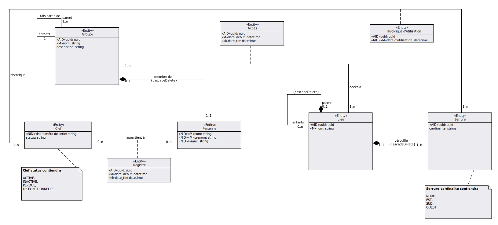
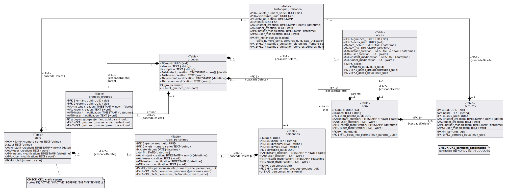
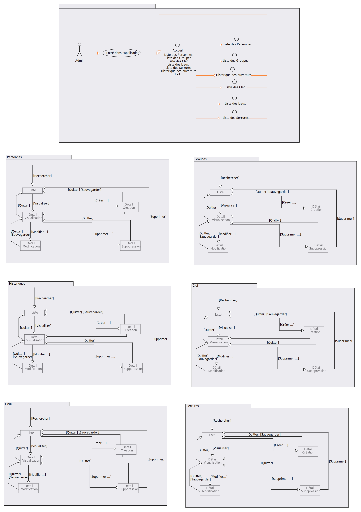
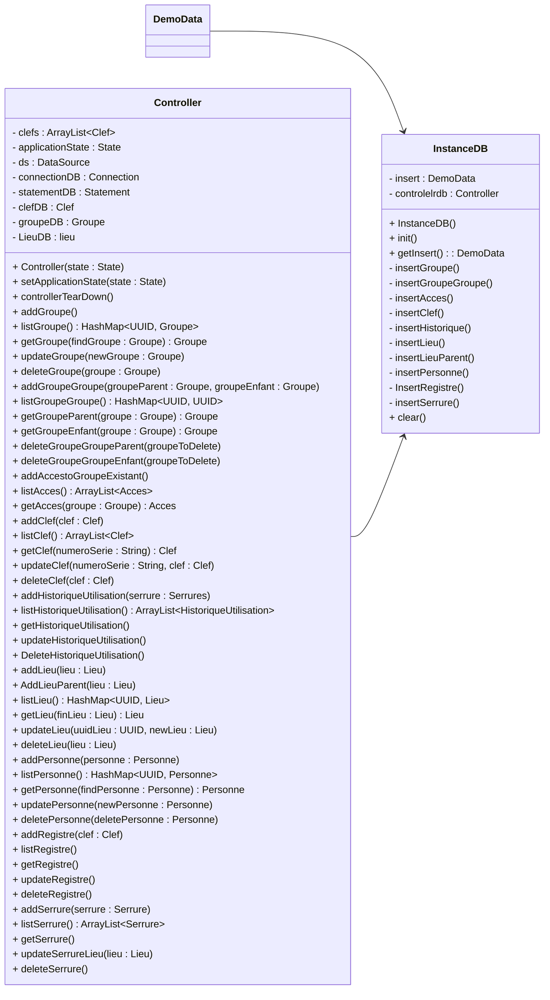

# 1. projet - Gestion des clefs d'une institution et historique des accès
- [1. projet - Gestion des clefs d'une institution et historique des accès](#1-projet---gestion-des-clefs-dune-institution-et-historique-des-accès)
- [2. Besoin](#2-besoin)
- [3. Livrables attendus](#3-livrables-attendus)
  - [3.1. Document d'analyse](#31-document-danalyse)
  - [3.2. Script de création de la base de données](#32-script-de-création-de-la-base-de-données)
  - [3.3. Implémentation](#33-implémentation)
  - [3.4. DoD (Definition of Done)](#34-dod-definition-of-done)
- [4. Base de donnée PSQL](#4-base-de-donnée-psql)
  - [4.1. MCD](#41-mcd)
  - [4.2. MLD](#42-mld)
  - [4.3. Prototypes](#43-prototypes)
  - [4.4. Diagramme de navigation](#44-diagramme-de-navigation)
  - [4.5. Scripts](#45-scripts)
    - [4.5.1. Tutoriel de création de la base de données](#451-tutoriel-de-création-de-la-base-de-données)
      - [4.5.1.1. Tutoriel de création de la base de données de test](#4511-tutoriel-de-création-de-la-base-de-données-de-test)
- [5. Programme JAVA](#5-programme-java)
  - [5.1. Modèle de classe](#51-modèle-de-classe)
    - [5.1.1. Modèle](#511-modèle)
    - [5.1.2. Controller](#512-controller)
- [6. Utilisation du projet](#6-utilisation-du-projet)
  - [6.1. Java](#61-java)
  - [6.2. Postgres](#62-postgres)
- [7. Liens](#7-liens)

# 2. Besoin

* un lieu peut être verrouillé par plusieurs serrures.
* une clef peut déverrouiller les serrures de plusieurs lieux.
* une personne est propriétaire d'une seul clef.
* une personne peut accéder à plusieurs lieux
* un lieu est composé de lieu.
* un historique des accès permet de connaître qui a accédé où et quand.
* un historique des modifications permet de connaître qui reçoit l'accès où et quand.

# 3. Livrables attendus 

## 3.1. Document d'analyse

Le document d'analyse doit contenir:
- [x] des maquettes d'interfaces (écran ou api) avec des données pertinentes et en nombre suffisant
- [x] un modèle conceptuel de données
- [x] un modèle logique de données
- [x] un modèle de classes
- [x] Le modèle logique de données doit être enrichi avec les champs d'audits. (voir SUNIER, 2016, *Modèle logique de données relationnel*, 14.2 Audit)

## 3.2. Script de création de la base de données

Le script de création doit:
- [x] Supprimer les tables du domaine
- [x] Créer les tables du domaine avec les contraintes
- [x] Ajouter dans les tables un jeu de données de test
- [x] Les champs d'audit sont mis à jour par l'intermédiaire de triggers et procédures stockées. Les commandes INSERT ou UPDATE ne peuvent pas directement modifier ces colonnes. 

## 3.3. Implémentation

Écrire:
- [x] Les classes du domaine et leurs classes de test
- [x] Une classe `DemoData` retournant un `Map<UUID,Entite>` pour chaque entité indépendante du domaine. Ces différents Map doivent contenir les données de test.
- [x] Des tests unitaires interrogeant la base de données à l'aide de la libraire JDBC et instanciant les classes du domaines. (éléments théorique voir [APS - Rappel Java, JDBC](https://mylos.cifom.ch/gitlab/dhu.cours/tutojava/070-tutojdbc/blob/master/JavaJDBC.md))

## 3.4. DoD (Definition of Done)

Le DoD précise la rigueur souhaitée avant de passer une tâche en terminer.

Documentation:
* Les documents doivent être validés par tous les membres du Groupe

SQL:
* Le MLD doit respecter les formes normales de 1 à 5
* Les scripts s'executent avec 0 erreur

Java:
* La classe doit pouvoir build et compile sans erreur
* Les tests doivent couvrir au moins 95% du code
* Les tests doivent être 100% validés

# 4. Base de donnée PSQL

## 4.1. MCD

## 4.2. MLD

## 4.3. Prototypes
[Prototypes](./doc/maquette.md)
## 4.4. Diagramme de navigation


## 4.5. Scripts
### 4.5.1. Tutoriel de création de la base de données
* Créer une base de donnée local "clefDB"
* Créer un utilisateur "clef" avec le MDP "clefPASS"
* Ajouter l'utilisateur clef à la base de donnée clefDB
* Executer le script "script.sh"
```
./script.sh > requete.log
```
#### 4.5.1.1. Tutoriel de création de la base de données de test
* Créer une base de donnée local "clefDB_Dev"
* Utiliser l'utilisateur "clef" avec le MDP "clefPASS"
* Utiliser l'utilisateur clef à la base de donnée clefDB
* Executer le script "scriptDev.sh"
```
./scriptDev.sh > requeteDev.log
```


# 5. Programme JAVA
## 5.1. Modèle de classe
### 5.1.1. Modèle

```mermaid
classDiagram
direction RL

class Clef{

-numeroserie: String
-status: ClefStatus
-registres: Arraylist~Registre~
-number: int
+Clef(numeroserie: String)
+Clef(numeroserie: String, status: ClefStatus)
+setNumeroSerie(numeroSerie: String)
+getNumeroSerie() String
+setClefStatus (status: ClefStatus)
+getClefStatus() ClefStatus
+addRegistre(registre: Registre)
+updateRegistre(registreOld: Registre, registreNew: Registre)
+getRegistre(index: int) Registre
+getFirstRegistre() Registre
+getLastRegistre() Registre
+getAllRegistre() Arraylist~Registre~
+isEmpty() boolean
+hashCode() int
+equals(obj : Object) boolean
+toString() String
}


class Registre{
-uuid: UUID
-date_debut: Timestamp
-date_fin: Timestamp
-personne: Personne
+registre(uuid: UUID,date_debut: Timestamp, personne: Personne)
+registre(uuid: UUID,date_debut: Timestamp, date_fin: Timestamp, personne: Personne)
+getUUID() UUID
+getDateDebut() Timestamp
+setDateFin(date: Timestamp)
+getDateFin() Timestamp
+setPersonne(personne: Personne)
+getPersonne() personne
+hashCode() int
+equals(obj : Object) boolean
+toString() String

}
class ClefStatus{
  <<enumeration>>
ACTIVE
INACTIVE
PERDUE
DISFONCTIONNELLE
}


class Personne{
-uuid: UUID
-nom: String
-prenom: String
-email: String
-groupe: Groupe
+personne(uuid: UUID, nom: String, prenom: String, email: String, Groupe: Groupe)
+getUUID() UUID
+setNom(nom: String)
+getNom() String
+setPrenom(prenom: String)
+getPrenom() String
+setEmail(email: String)
+getEmail() String
+setGroupe(Groupe: Groupe)
+getGroupe() Groupe
+hashCode() int
+equals(obj : Object)  boolean
+toString() String
}


class Acces{
  -uuid: UUID
  -date_debut: LocalDateTime
  -date_fin: LocalDateTime
  -lieu: Lieu
  +Acces(uuid : UUID , date_debut : datetime,date_fin : datetime,lieu : Lieu)
  +Acces(date_debut : datetime,date_fin : datetime,lieu : Lieu)
  +getUuid() UUID
  +setUuid(uuid: UUID) 
  +getdate_debut() LocalDateTime
  +setdate_debut(dateDebut : LocalDateTime)
  +getdate_fin() LocalDateTime
  +setdate_fin(dateFin : LocalDateTime)
  +getLieu() Lieu
  +setLieu(lieu : Lieu)
  +hashCode() int
  +equals(obj : Object)  boolean
  +toString() String
}

class Lieu{
  -uuid: UUID
  -nom: String
  -lieuParent: Lieu
  -serrures: ArrayList~Serrure~
  +lieu(nom: String)
  +lieu(nom: String, lieuParent: Lieu)
  +lieu(uuid: UUID, nom: String)
    +lieu(uuid: UUID, nom: String, lieuParent: Lieu)
  +lieu(uuid: UUID , nom: String , lieuParent:  lieu, serrures: ArrayList~Serrure~)
  +getuuid() UUID
  +getnom() String
  +setnom(nom : String)
  +getLieuParent() Lieu
  +setLieuParent(lieu : Lieu)
  +addSerrure(serrure: Serrure)
  +getSerrure(index: int) Serrure
  +getFirstSerrures() Serrure
  +getLastSerrures() Serrure
  +getAllSerrures() ArrayList~Serrure~
  +isEmpty() boolean
  +hashCode() int
  +equals(obj : Object)  boolean
  +toString() String
}

class Serrure{
 -uuid: UUID
 -cardinalite: Cardinalite
 -historiques: Arraylist~HistoriqueUtilisation~
 +serrure(cardinalite: Cardinalite)
 +serrure(cardinalite: Cardinalite, historiques: Arraylist~HistoriqueUtilisation~)
 +serrure(uuid : UUID , cardinalite : Cardinalite)
 +serrure(uuid : UUID , cardinalite : Cardinalite, historiques: Arraylist~HistoriqueUtilisation~)
 +getuuid() UUID
 +getcardinalite() Cardinalite
 +setcardinalite(cardinalite : Cardinalite)
 +addHistoriqueUtilisation(historiqueUtilisation: HistoriqueUtilisation)
 +getHistoriqueUtilisation(index: int) HistoriqueUtilisation
 +getFirstHistoriqueUtilisation() HistoriqueUtilisation
 +getLastHistoriqueUtilisation() HistoriqueUtilisation
 +getAllHistoriqueUtilisation() Arraylist~HistoriqueUtilisation~
 +isEmpty() boolean
 +hashCode() int
 +equals(obj : Object)  boolean
 +toString() String
}


class Groupe{
-uuid: UUID
-nom: String
-description: String
-groupesParent: ArrayList~Groupe~
-groupesEnfant: ArrayList~Groupe~
-acces: ArrayList~Acces~
+Groupe(uuid : UUID, nom : String, nom : String, description : String )
+Groupe(uuid : UUID, nom : String, nom : String, description : String, groupesParent : ArrayList~Groupe~, groupesEnfant : ArrayList~Groupe~, acces : ArrayList~Acces~)
+getUuid() UUID
+setNom(newNom : String)
+getNom() String
+setDescription(newDescription : String)
+getDescription() String
+getAllGroupesParent() ArrayList~Groupe~
+getIndexGroupesParent(index : Integer) Groupe
+getLastGroupesParent() Groupe
+addGroupesParent(newGroupe : Groupe)
+getAllGroupesEnfant() ArrayList~Groupe~
+getIndexGroupesEnfant(index : Integer) Groupe
+getLastGroupeEnfant() Groupe
+addGroupesEnfant(newGroupe : Groupe)
+getAllAcces() ArrayList~Acces~
+getIndexAcces(index : Integer) Acces
+getLastAcces() Acces
+addAcces(newAcces : Acces)
+hashCode() int
+equals(obj : Object) boolean
+toString() String
}

class Cardinalite{
  <<enumeration>>
NORD
EST
SUD
OUEST
}
class HistoriqueUtilisation{
-clef: Clef 
-status: Boolean
-dateUtilisation: Timestamp
+HistoriqueUtilisation(clef : Clef,status : Boolean)
+getClef() Clef
+getStatus() Boolean
+getDateUtilisation() Timestamp
+hashCode() int
+equals(obj : Object) boolean
+toString() String
}

Clef <-- HistoriqueUtilisation
HistoriqueUtilisation <-- Serrure
Lieu <-- Lieu
Serrure <-- Lieu
Acces --> Lieu
Groupe --> Acces
Clef --> Registre
Registre --> Personne
Personne --> Groupe
Serrure ..  Cardinalite
Clef .. ClefStatus
Groupe <--> Groupe
```

### 5.1.2. Controller

# 6. Utilisation du projet
## 6.1. Java
- Pour utiliser le projet sur un serveur différent modifier [Le fichier de propriété](java/clef/DB.properties)
```properties
#Données de connexion à la BD
#Nom ou adresse du serveur postgre
serverName = 127.0.0.1
#port d'accès du serveur de postgre
portNumber = 5432
#Nom de la base de donnée
dataBaseName = clefDB
#Utilisateur ayant accès à la BD
user = clef
#Mot de passe de l'utilisateur
password = clefPASS
```
Idem pour la BD de [dev](java/clef/DBDev.properties)
## 6.2. Postgres
- Pour utiliser les scripts il faut modifier le script de [connexion](./psql/script.sh)
```sh
#!/bin/bash
#Nom ou adresse du serveur postgres
HOST=127.0.0.1
#port d'accès du serveur de postgres
PORT=5432
#Utilisateur ayant accès à la BD
USER=clef
#Mot de passe de l'utilisateur
PASSWORD=clefPASS
#Nom de la base de donnée
DATABASE=clefDB
PSQL_SCRIPT=script.psql

PGPASSWORD=$PASSWORD psql -h $HOST -p $PORT -U $USER $DATABASE -f $PSQL_SCRIPT
```
Idem pour la BD de [test](psql/scriptDev.sh)
# 7. Liens
[SCRUM POKER](https://www.scrumpoker-online.org/fr/)

[UML](https://laurent-audibert.developpez.com/Cours-UML/?page=mise-en-oeuvre-uml#L9-3-2)

[JDBC](https://mylos.cifom.ch/gitlab/dhu.cours/tutojava/070-tutojdbc/blob/master/JavaJDBC.md)

[MERMAID markdown Diagramme de classe](https://mermaid-js.github.io/mermaid/#/./classDiagram)

[DemoData - Fichier de démo](https://mylos.cifom.ch/gitlab/dhu.projets/campanule/campanule.lib/-/blob/master/src/main/java/campanule/domain/DemoData.java)
